# Exno:1
Data Cleaning Process

# AIM
To read the given data and perform data cleaning and save the cleaned data to a file.

# Explanation
Data cleaning is the process of preparing data for analysis by removing or modifying data that is incorrect ,incompleted , irrelevant , duplicated or improperly formatted. Data cleaning is not simply about erasing data ,but rather finding a way to maximize datasets accuracy without necessarily deleting the information.

# Algorithm
STEP 1: Read the given Data

STEP 2: Get the information about the data

STEP 3: Remove the null values from the data

STEP 4: Save the Clean data to the file

STEP 5: Remove outliers using IQR

STEP 6: Use zscore of to remove outliers

# Coding and Output
```
import pandas as pd
df=pd.read_csv("/content/SAMPLEIDS.csv")
df
```
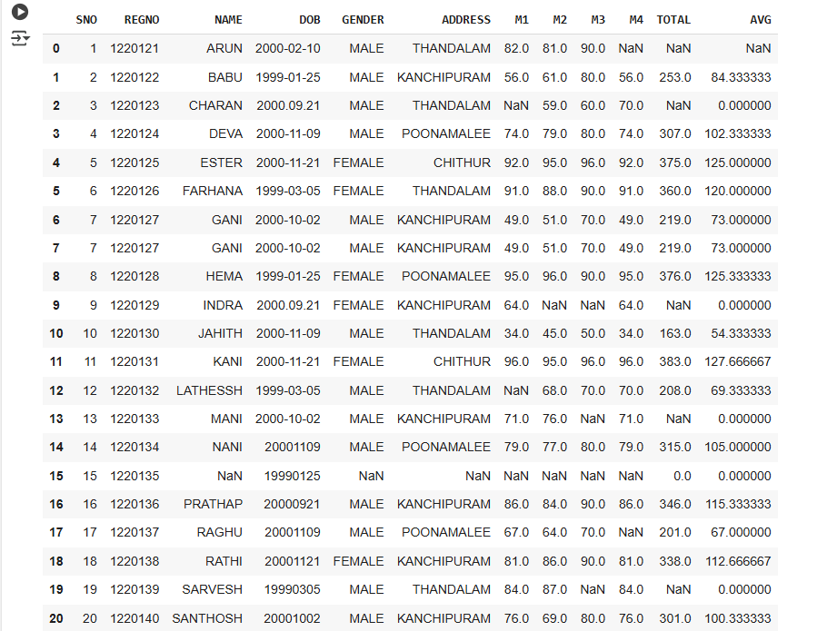

```
df.head(6)
```
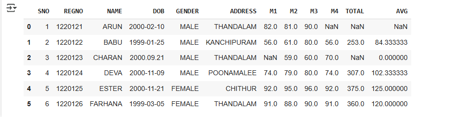

```
df.tail()
```
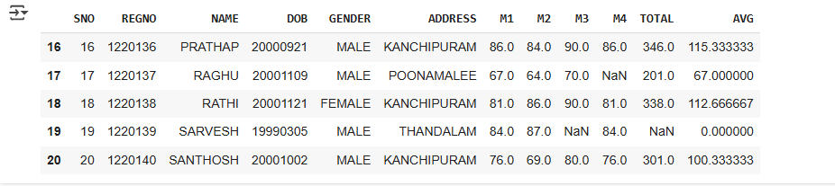

```
df.shape
```


```
df.isnull()
```
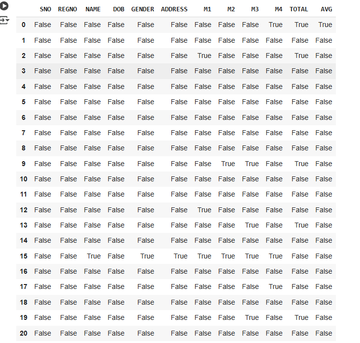

```
df.fillna(200)
```
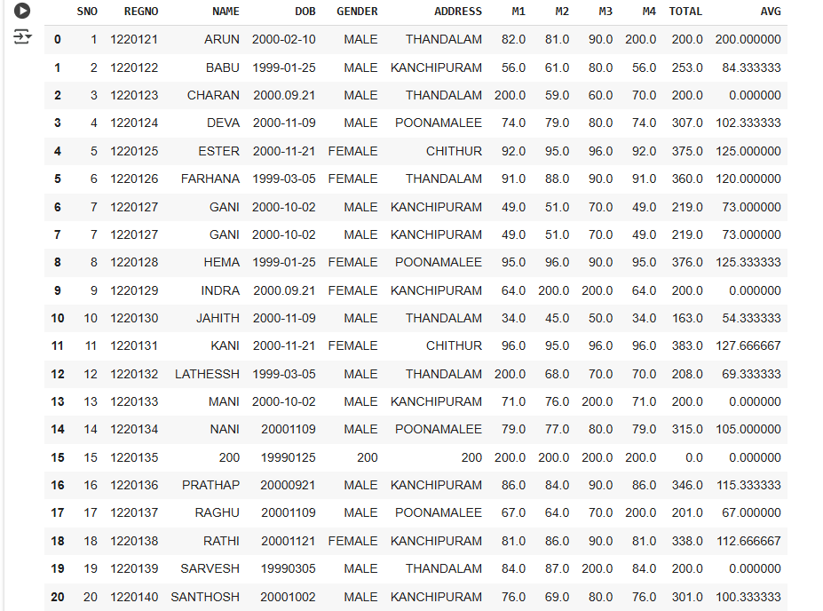
```
df.dropna(axis=1)
```
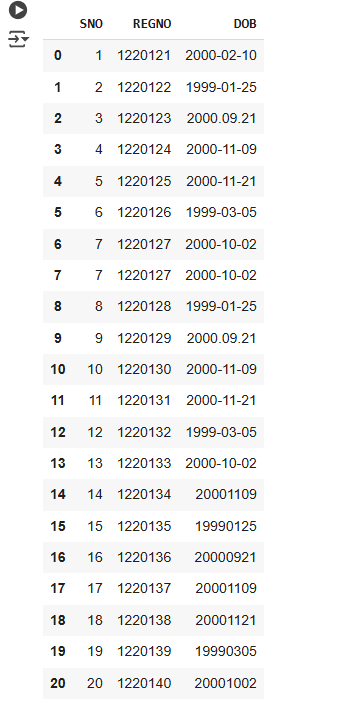
```
df.info()
```
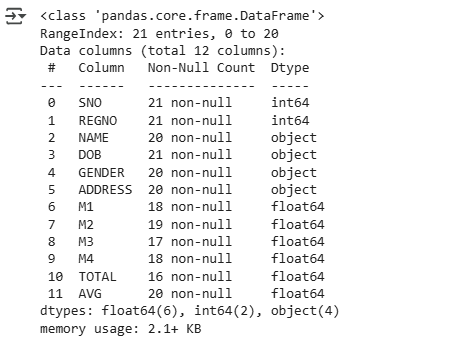
```
df.isnull().sum()
```
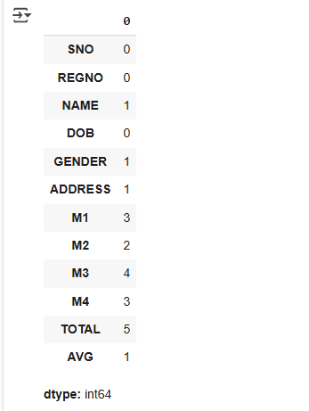

```
df.isnull().any()
```
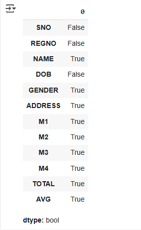
```
df.fillna(method = 'ffill')
```
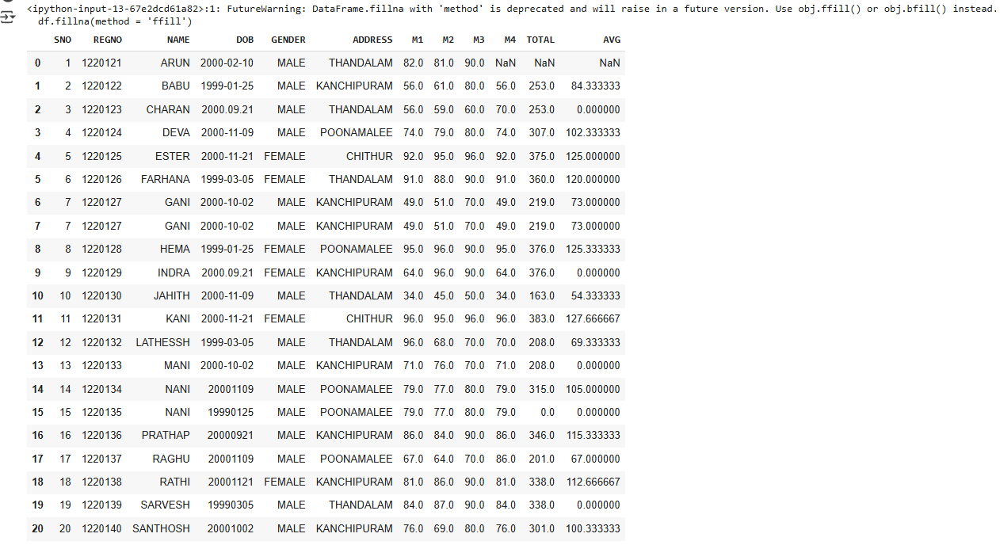
```
df.fillna(method = 'bfill')
```
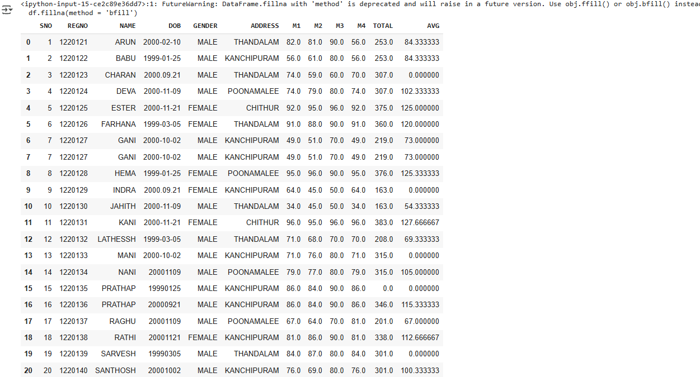
```
df.fillna({'GENDER':'MALE','NAME':'SRI','ADDRESS':'POONAMALEE','M1':'98','M2':'87','M3':'76','M4':'92','TOTAL':'305','AVG':'89'})
```
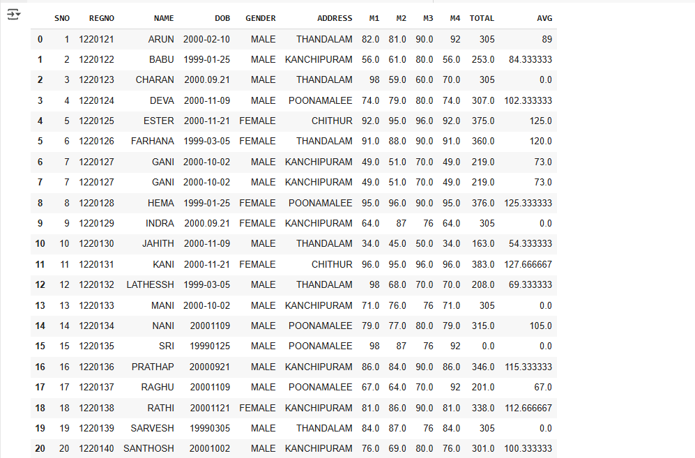

```
ir=pd.read_csv("/content/iris.csv")
ir
```
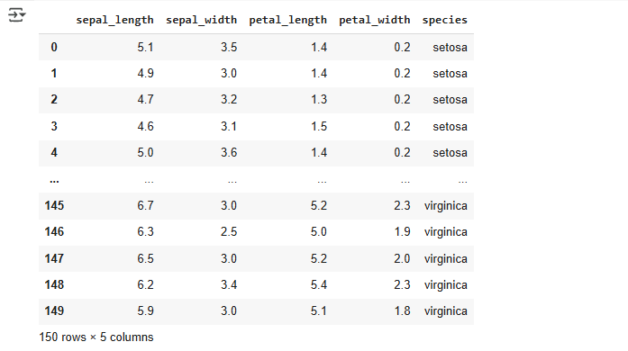
```
ir.describe()
```
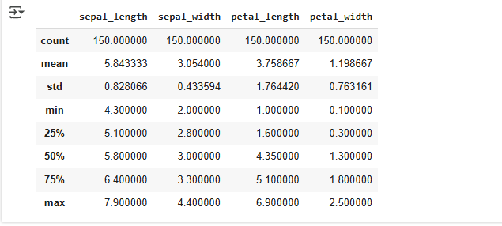

```
import seaborn as sns
sns.boxplot(x='sepal_width',data=ir)
```
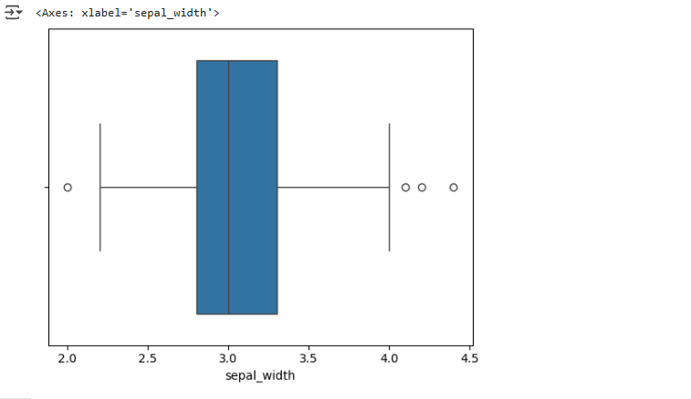
```
q1=ir.sepal_width.quantile(0.25)
q3=ir.sepal_width.quantile(0.75)
iqr=q3-q1
print(iqr)
```
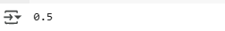
```
rid=ir[((ir.sepal_width<(q1-1.5*iqr))|(ir.sepal_width>(q3+1.5*iqr)))]
rid['sepal_width']
```
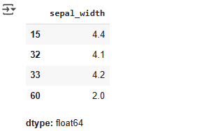
```
delid=ir[~((ir.sepal_width<(q1-1.5*iqr))|(ir.sepal_width>(q3+1.5*iqr)))]
delid
```
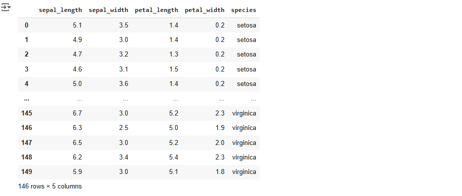
```
sns.boxplot(x='sepal_width',data=delid)
```
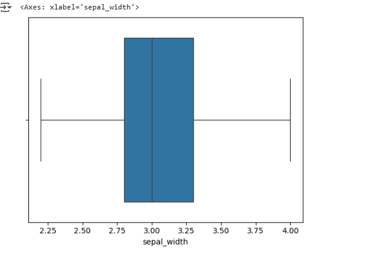
```
z = np.abs(stats.zscore(ir['sepal_width']))
z
```
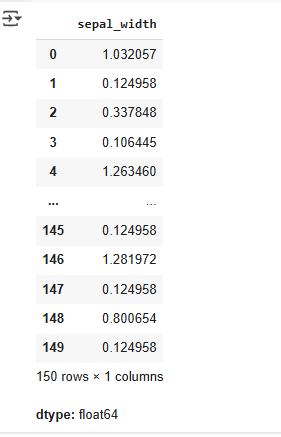
```
df1 = ir[z<3]
df1
```
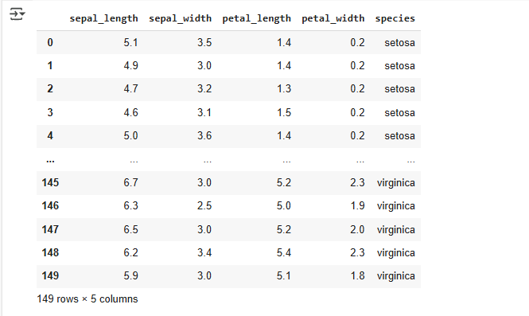
# Result
Thus the Data Cleaning Process and Detecting and Removal of Outliers is executed successfully.   
